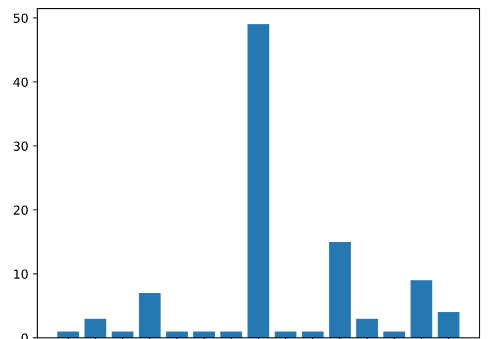
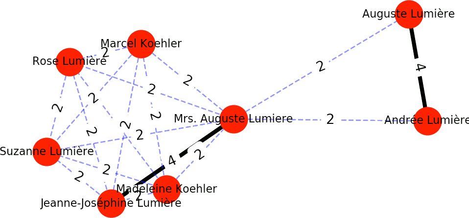

# IMDB-Crawler

This program crawls the [IMDB](https://www.imdb.com/) website and generates the following results:

* Names of movies and directors written in a file (_movies.txt_) separated by `#` in offline mode
* a bar chart of the number of movies a director has made  

* a graph between the actors of these movies, the nodes are the actor names, they are connected by edges if they has been in a film together, the edges have weights. (Only in online mode.)  

* ratings of each movie based on demographic and rating percentages and ... (for now only works in `--crawl` mode)

Use with `--crawl` flag for online mode or `--file` flag for offline mode.